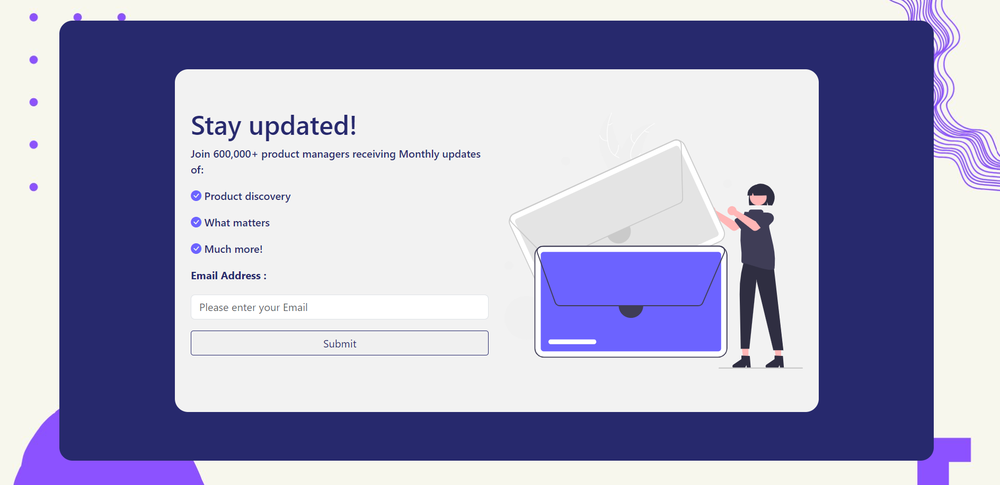

# Newsletter Subscription Form

A visually appealing and fully responsive newsletter subscription form built using HTML, CSS, and JavaScript. This project is designed to collect email subscriptions effectively and provides a customizable template for integration into websites.

## Features

- Responsive Design:
    The form adapts to various devices and screen sizes, ensuring a seamless user experience.

- Modern Styling:
    Styled with CSS to create a professional and visually engaging layout.

- Client-Side Validation:
    Includes basic validation to ensure users enter a valid email address.

- Customizable:
    Easy to modify and integrate into existing projects.

## How to Use

1. Download or Clone the Project:
    Download the project files or clone the repository to your local machine.

2. Open the HTML File:
    Open the index.html file in your browser to view the form.

3. Customize:
    - Update the text, colors, or layout in the HTML/CSS files to match you branding.
    - Modify the JavaScript code for additional validation or functionality.

4. Deploy:
    Embed the form into your website or host it independently.

## Dependencies

- HTML5: Markup language used for structure.
- CSS3: Styling and layout.
- JavaScript: Basic interactivity and email validation.

## Contributing

Feel free to contribute by forking the repository, making changes, and submitting a pull request.